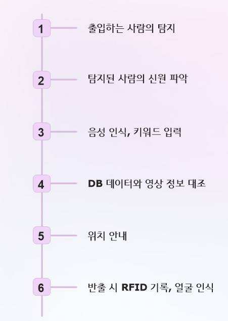
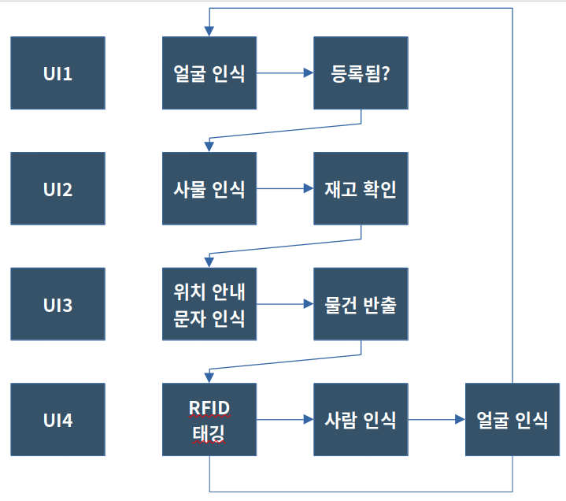
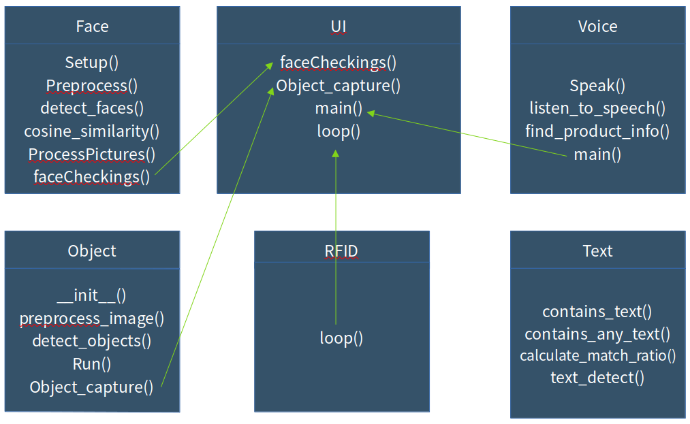
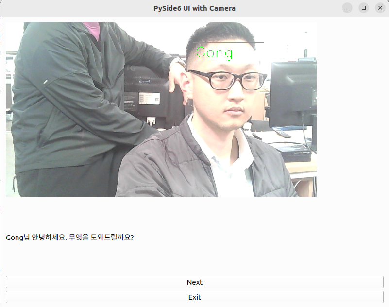
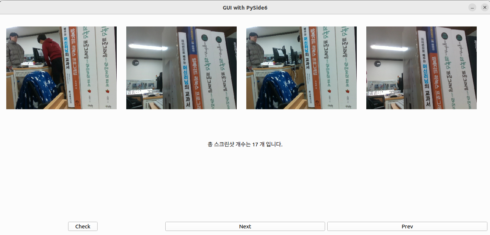
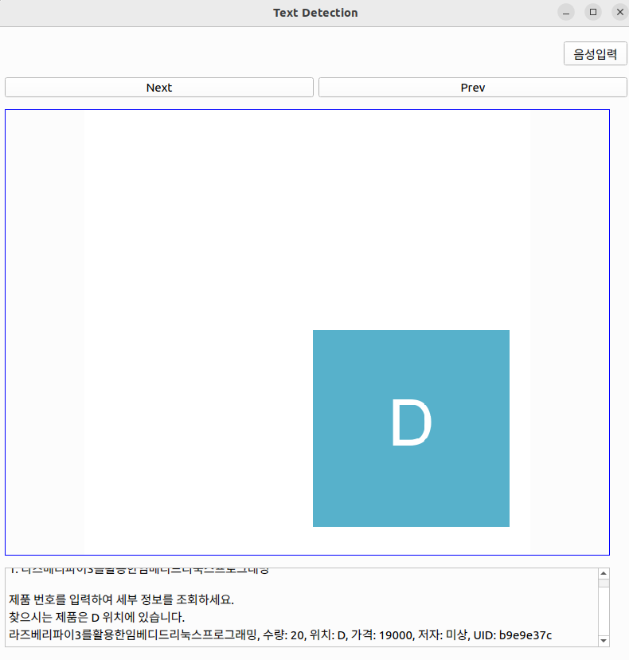
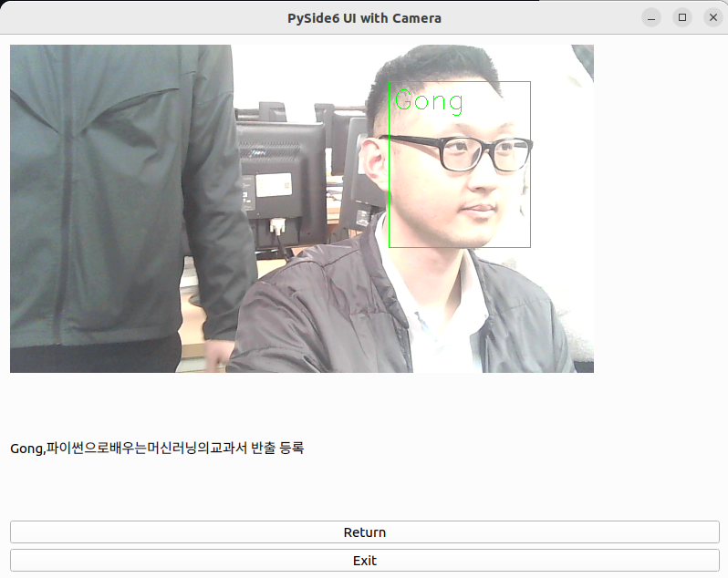

# Project AI Inventory

    직원과 물건의 확인을 바탕으로 한 재고 관리 자동화 프로젝트

## High Level Design

## Clone code

    git clone https://github.com/Mazogorath/AI_Inventory.git

## Prerequite

python -m venv .venv 
source .venv/bin/activate 
sudo apt-get install portaudio19-dev 
sudo apt-get install ffmpeg 
pip install -r requirements.txt 

## Steps to build

    (프로젝트 실행을 위한 빌드 절차 기술)

cd ~/xxxx
source .venv/bin/activate

make
make install

## Steps to run

python3 total_gui.py

## Output

## Appendix

https://youtu.be/ZHjXpxrN4Ws

## 시연영상
1화면만 있는 영상 : https://youtu.be/ZHjXpxrN4Ws
2 발표 장소에서 촬영한 것 : https://youtu.be/wR9NyhMVFlk
